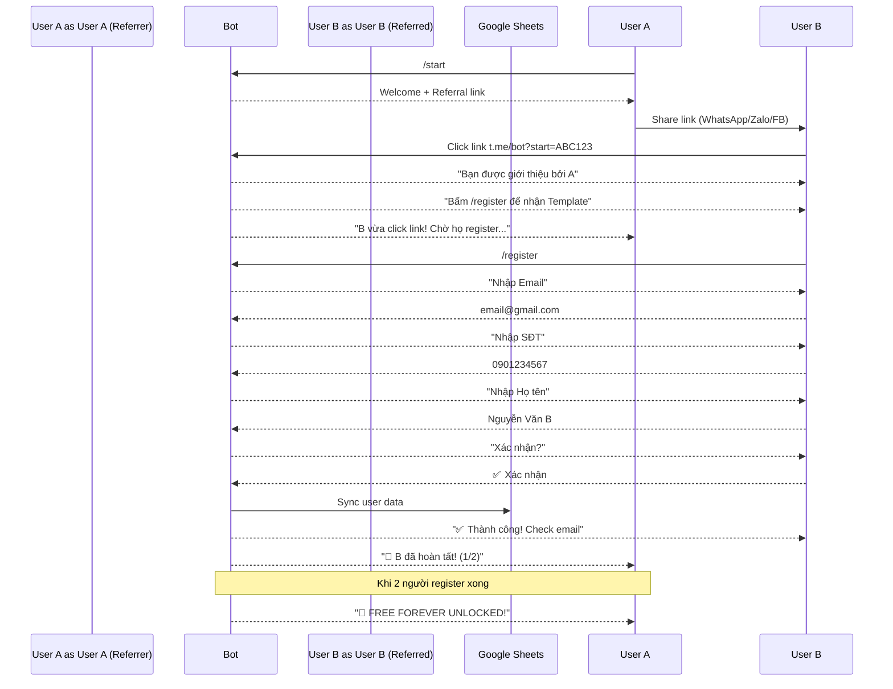

# 🎯 Registration & Referral Flow - Quick Start

## NEW FLOW: Referral with Registration Verification

### 📊 Overview
Người được giới thiệu **phải hoàn tất đăng ký** (Email, Phone, Name) thì mới tính 1 referral thành công.

### 🔄 Complete Flow



---

## 🚀 Setup & Test

### 1. Run Database Migration

```powershell
cd "d:\Projects\FreedomWalletBot"
python migrate_db.py
```

**Expected output:**
```
🔧 Running database migration...
✅ Migration completed!
📊 Total users: 1
```

### 2. Start Bot

```powershell
python main.py
```

### 3. Test Registration Flow

#### **Test Case 1: New User Registers Directly**

1. Open Telegram → `/start`
2. **Expected:** Welcome with button **"📝 Đăng ký nhận Template FREE"**
3. Click button → Bot says "Gõ /register"
4. Run `/register`
5. **Flow:**
   ```
   Bot: Nhập Email
   You: test@gmail.com
   
   Bot: Nhập SĐT (hoặc /skip)
   You: 0901234567
   
   Bot: Nhập Họ tên (hoặc /skip)
   You: Nguyen Van A
   
   Bot: Xác nhận thông tin?
   You: ✅ Xác nhận
   
   Bot: ✅ ĐĂNG KÝ THÀNH CÔNG!
        📧 Kiểm tra email...
   ```

---

#### **Test Case 2: User Joins via Referral Link**

**Step 1: User A gets referral link**

1. User A: `/referral`
2. **Expected:** 
   ```
   🎁 HỆ THỐNG GIỚI THIỆU

   🎯 Còn 2 người nữa để mở khóa FREE!

   🔗 Link giới thiệu:
   https://t.me/YourBot?start=ABC123
   ```

3. Copy link

**Step 2: User B clicks link (NEW ACCOUNT)**

1. Open link in another Telegram account
2. **Expected:**
   ```
   🎉 Chào mừng bạn đến Freedom Wallet!

   Bạn được giới thiệu bởi User A.

   📝 Bước tiếp theo:
   Để nhận Template và giúp User A mở khóa FREE...

   Bấm /register để bắt đầu! 🚀
   ```

**Step 3: User A receives notification**

```
🎊 Tin vui!

User B vừa nhấn vào link!

⏳ Đang chờ họ hoàn tất đăng ký...
```

**Step 4: User B registers**

1. User B: `/register`
2. Fill form (email, phone, name)
3. Confirm

**Step 5: Verification & Count Update**

User B:
```
✅ ĐĂNG KÝ THÀNH CÔNG!
📧 Kiểm tra email...
```

User A:
```
🎊 Tin vui!

Nguyen Van B vừa hoàn tất đăng ký!

📊 Tiến độ: 1/2 người
🎯 Còn 1 người nữa để mở khóa FREE!
```

**Step 6: After 2nd person registers**

User A:
```
🎉🎉🎉 CHÚC MỪNG! 🎉🎉🎉

Bạn vừa mở khóa FREE FOREVER!

✅ Quyền lợi:
✓ Bot không giới hạn
✓ Template Freedom Wallet
...
```

---

## 📊 Check Google Sheets

### Open Sheet: User Registrations

Go to: [Google Sheet ID from .env]

**Expected columns:**
| Telegram ID | Họ Tên | Email | SĐT | Ngày Đăng Ký | Trạng Thái |
|-------------|--------|-------|-----|---------------|------------|
| 123456789 | Nguyen Van B | test@gmail.com | 0901234567 | 2026-02-07... | Active |

---

## 🔍 Verify Database

```powershell
python

>>> from bot.utils.database import *
>>> session = SessionLocal()
>>> 
>>> # Check users
>>> users = session.query(User).all()
>>> for u in users:
...     print(f"User {u.id}: Email={u.email}, Registered={u.is_registered}")
>>> 
>>> # Check referrals
>>> refs = session.query(Referral).all()
>>> for r in refs:
...     print(f"Ref: {r.referrer_id} -> {r.referred_id} | Status: {r.status}")
>>> 
>>> session.close()
```

**Expected output:**
```
User 111: Email=userA@gmail.com, Registered=True
User 222: Email=userB@gmail.com, Registered=True

Ref: 111 -> 222 | Status: VERIFIED
```

---

## ⚙️ Configuration

### .env File

Ensure you have:

```env
# Required for Google Sheets sync
GOOGLE_SHEETS_CREDENTIALS=google_service_account.json
SUPPORT_SHEET_ID=your-sheet-id-here
```

### Google Service Account Setup

1. Go to [Google Cloud Console](https://console.cloud.google.com)
2. Create Service Account
3. Download JSON key → Save as `google_service_account.json`
4. Share Google Sheet with service account email
5. Add Sheet ID to `.env`

---

## 📱 Share Message

Khi click **"📢 Chia sẻ ngay"**, message hiển thị:

```
🎁 Freedom Wallet - Ứng dụng quản lý tài chính cá nhân hiện đại!

✅ FREE cho 1000 người đầu tiên! 
Giới thiệu 2 bạn để nhận miễn phí trọn đời.

📊 6 Hũ Tiền | 📈 Theo dõi đầu tư | 💰 Tối ưu chi tiêu

https://t.me/YourBot?start=ABC123
```

---

## 🐛 Troubleshooting

### Issue: "Sheets client not initialized"

**Solution:** Google Sheets credentials chưa setup

```powershell
# Check credentials file exists
ls google_service_account.json

# If missing, download from Google Cloud Console
```

### Issue: Referral count không tăng

**Reason:** User chưa complete registration

**Check:**
```python
>>> session.query(Referral).filter(Referral.referred_id == 222).first().status
'PENDING'  # Chưa VERIFIED
```

### Issue: Email không nhận được

**Reason:** Email sending chưa implement (đang TODO)

**Workaround:** Check data trong Google Sheet

---

## ✅ Success Criteria

- [x] User A shares link
- [x] User B clicks → sees "Bạn được giới thiệu..."
- [x] User B runs `/register` → fills form
- [x] Referral status: PENDING → VERIFIED
- [x] User A's referral_count increments
- [x] Data synced to Google Sheets
- [x] Auto-unlock FREE at 2 referrals

---

## 📈 Next Steps

### Phase 2: Email Integration
- [ ] SendGrid/Mailgun setup
- [ ] Send template link via email
- [ ] Welcome email template

### Phase 3: Analytics
- [ ] Track conversion rate (clicks → registrations)
- [ ] Leaderboard for top referrers
- [ ] Referral performance dashboard

---

**Ready to test!** 🚀

Questions? Check main [REFERRAL_SYSTEM.md](REFERRAL_SYSTEM.md)
